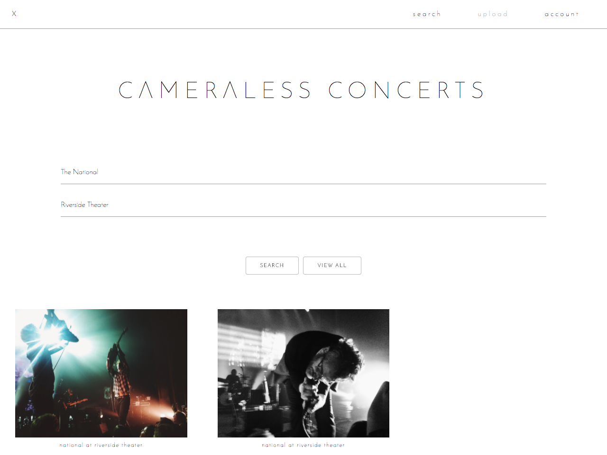
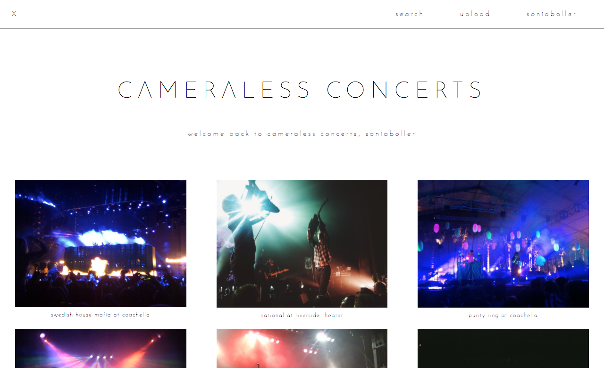

# General Assembly - WDI Project #2: Full-Stack Application

## Cameraless Concerts
Landing Page:  
  

Searching for images of The National:  
  

All User's Photos:  
  

## About:
Share more, experience more.
Cameraless Concerts relieves the pressure of taking photos at concerts, because more than likely someone else is already doing that for you. Whether it be you forgot your camera or your phone died, our aim is to have collective sharing of concert photos so more time is spent enjoying the show.

**Contributors:** Sonia Boller, Karly Hoffman

## Project Requirements:
-  **Have at least two models** (more if they make sense!) - one representing someone using the application, and one that represents the main functional idea for the app.
- **Include sign-up/log-in functionality**, with encrypted passwords & an authorization flow.
- **Utilize an ORM (such as Bookshelf.js) to create a database table structure** and interact with your relationally-stored data.
- **Include wireframes** designed during planning process.
- Have **semantically clean HTML and CSS**.
- Be responsive.

## Technologies:
- Node.js
- Express
- Sessions
- Bookshelf.js
- Gulp
- Handlebars
- Sass
- Materialize.css

## Approach:
- Establish wireframes and user stories
- Build server and gulp tasks
- Create models
- Implement user login with Express Sessions
- Create routes and controllers
- Stylize

Wireframes: 

User Story:

